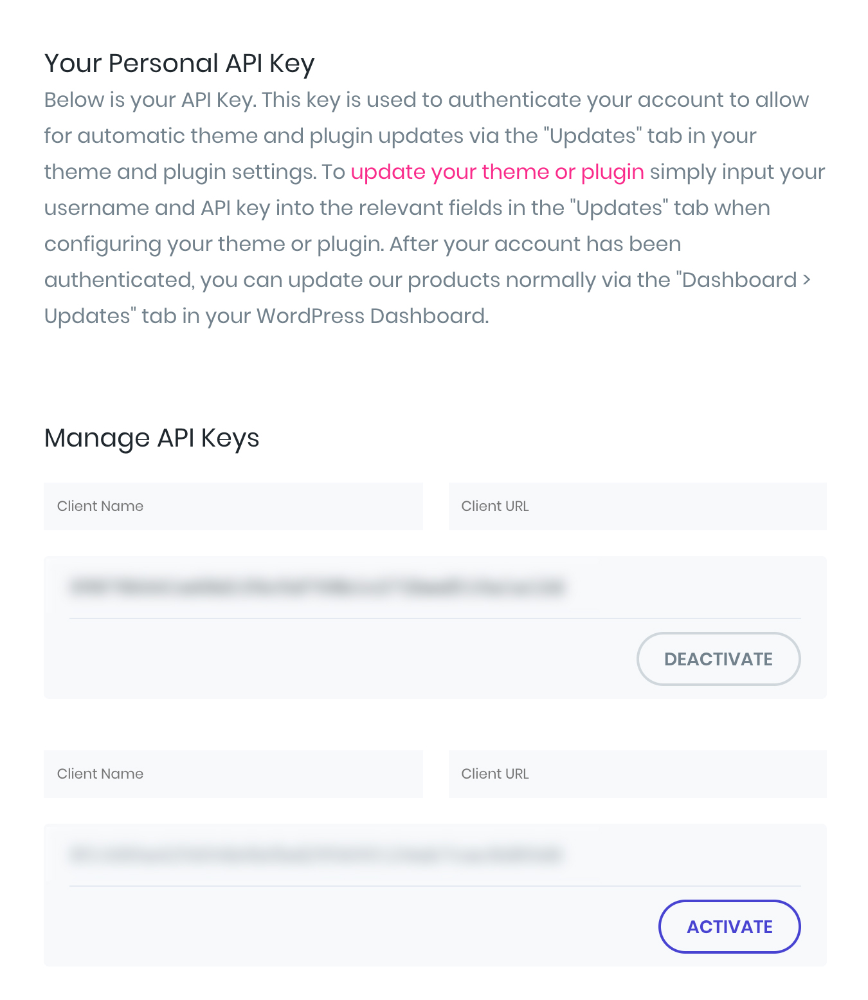

# Elegant-API-Manager
A Chrome Extension to add client management fields to Elegant Theme's API Page

# How To Use

1. Download as zip and unpack on your computer. 
2. In Chrome, head to chrome://extensions/ and toggle 'Developer Mode' to on.
3. Click 'LOAD UNPACKED' and choose the Elegant-API-Manager folder. 

You'll now have fields for client name and URL when visiting https://www.elegantthemes.com/members-area/api/

